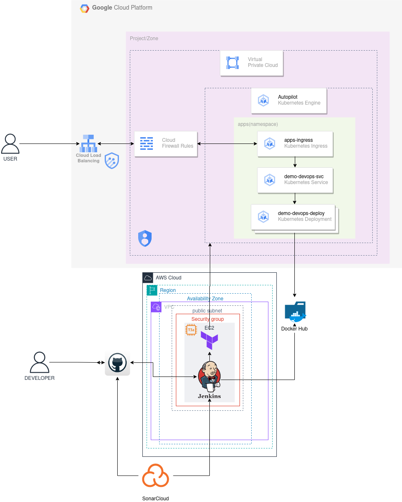

# Devops Prueba tecnica

## Descripcion de la solución

La solucion a la prueba técnica involucra las siguientes herramientas y stacks tecbológicos:

* VCS: Git/GitHub

* Codebase: Aplicación SpringBoot - Java con gestión de configuración con Maven.

* Orquestador Ci/Cd: Jenkins corriendo en una instancia EC2 en AWS.

* Static Code Analysis: SonarQube a través de su SaaS SonarCloud.

* Container image registry: Docker Hub.

* Infraestructura: Cluster de Kubernetes administrado GKE en GCP y manejado como IaC por Terraform.

### Diagrama

A continuacion de presenta el correspondiente diagrama que representa la solución y como se hizo uso de las herramientas y stack utilizados

### Posibles mejoras

* Implementar HTTPS/TLS para acceder a los endpoints de la aplicacion. Esto se conseguiría implementando el servicio cert-manager dentro del cluster K8s.
* Para acceder al servicio a traves de un nombre de dominio tambien se podría implementar DNS con el mismo proveedor de nube u otro provedor de este tipo de servicios.

> **Notes:**
> La url publica donde se encuentra expuesta la app: http://35.226.140.75/
> La url publica con la documentación de la API: http://35.226.140.75/api/swagger-ui/index.html
> #### La app se encuentra disponible publicamento solo hasta mañana jueves 28 de diciembre!
> 
